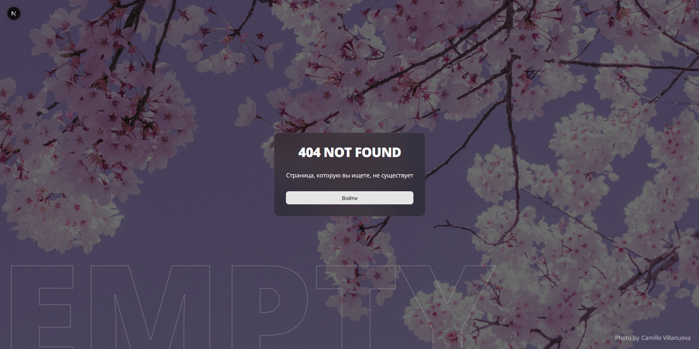
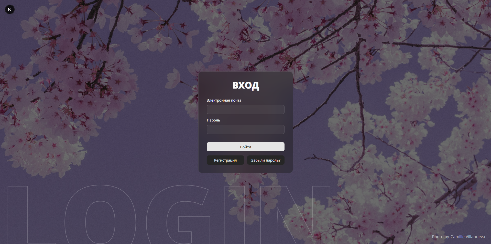
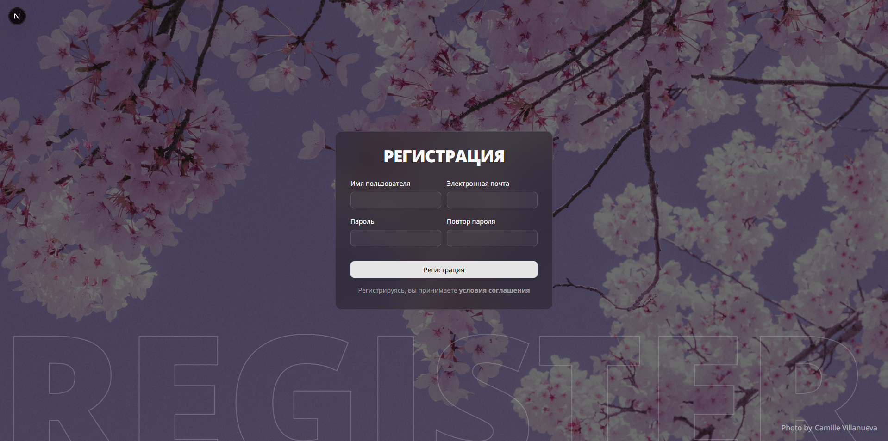
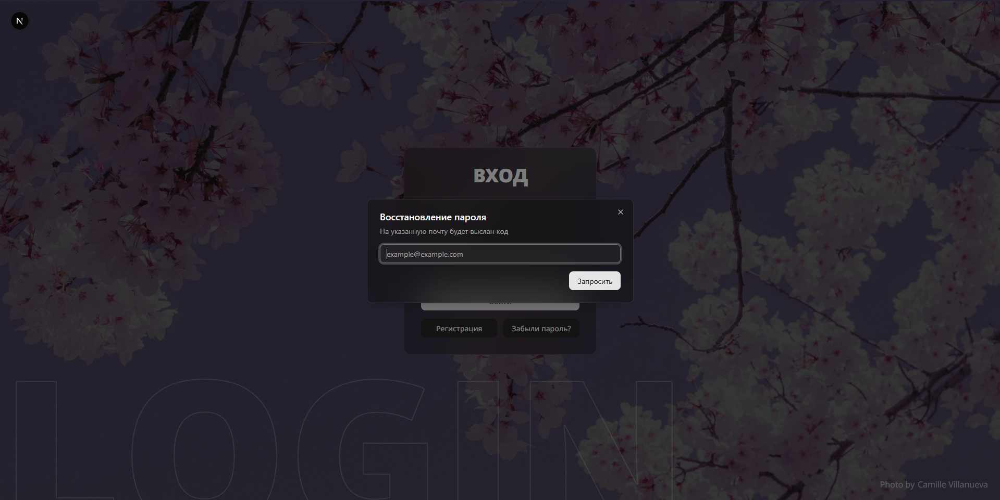
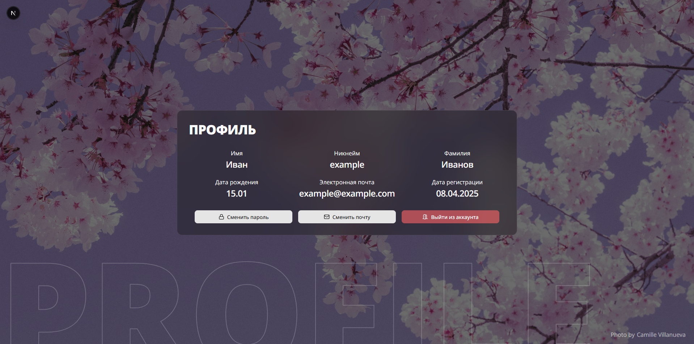
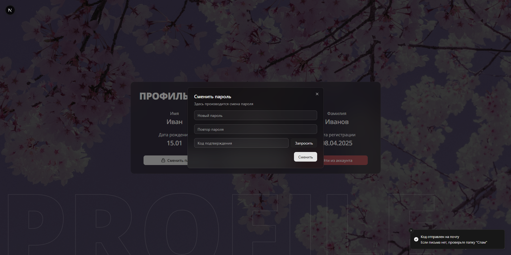

# Login page mockup
Мокап страницы авторизации, который можно адаптировать под ваши проекты на Next.js.

### В основе:
- [Next.js](https://nextjs.org/)
- [TailwindCSS](https://tailwindcss.com/)
- [shadcn/ui](https://ui.shadcn.com/)

### Функционал:
- Смена светлой и темной темы
- Адаптация под телефоны (не только размеры, но и эффекты размытия)
- Модальные окна на кнопках смены пароля/почты и восстановления пароля
- "Тосты" при выполнении некоторых действий

### Готовые страницы:
- 404 Not Found (`/`)
- Страница авторизации (`/login`)
- Страница регистрации (`/register`)
- Страница профиля (`/profile`) (концепт, может измениться)

### ВНИМАНИЕ
Страницы **НЕ ГОТОВЫ** для plug-and-play backend, и все компоненты 
нуждаются в доработке конкретно **ПОД ВАШ ПРОЕКТ**. Не нужно задавать вопросы
"Почему [вставьте вещь из backend] не работает?"

